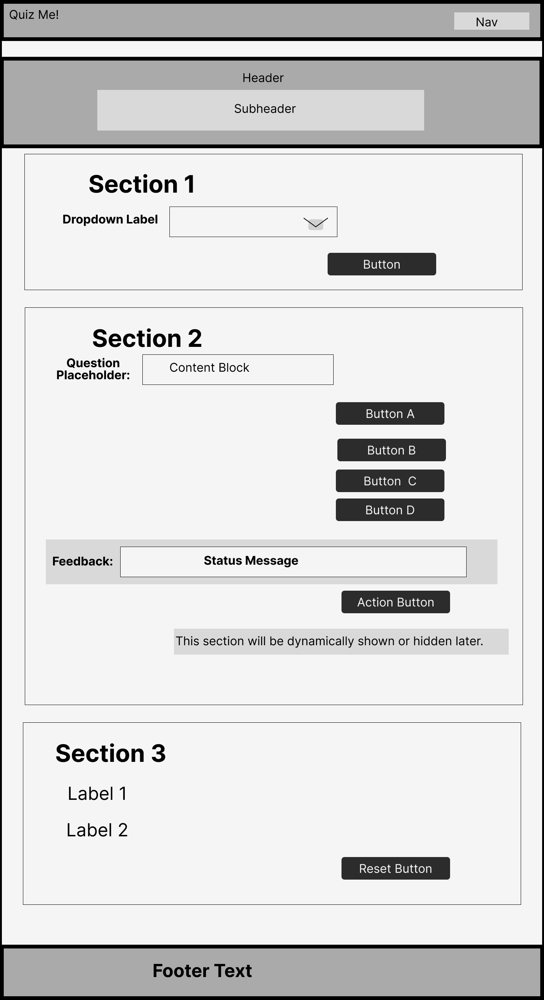
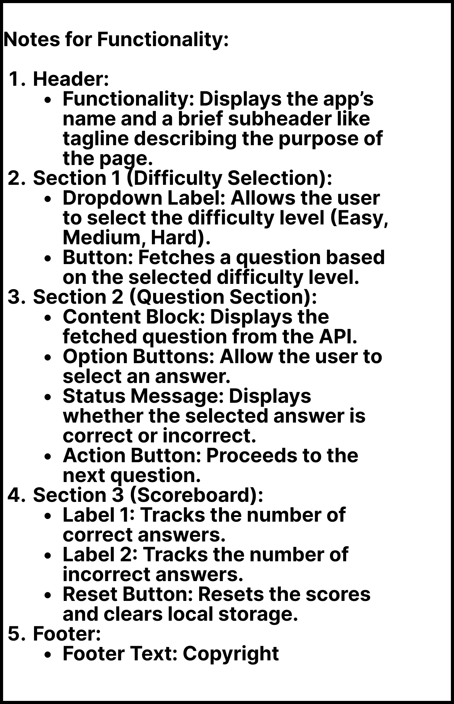
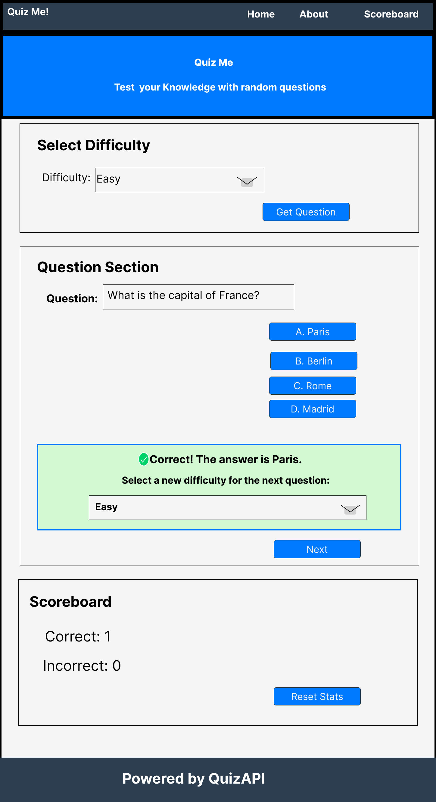
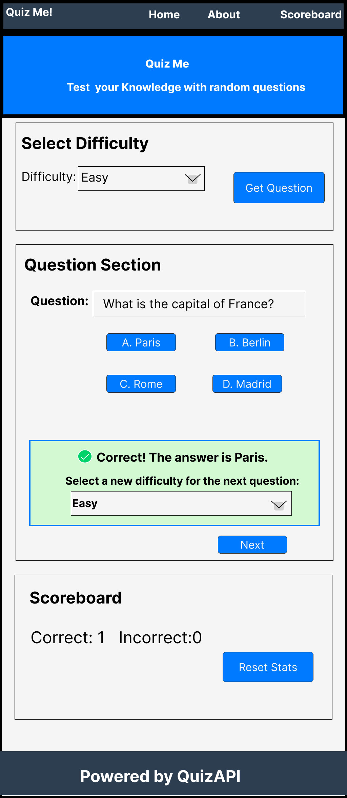
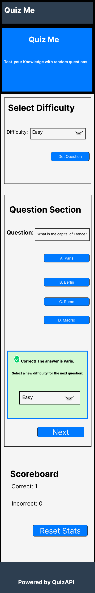

# mtm6302-capstone-busa0019

## Student Information
**Name:** Faoziyyah busari  
**Student Number:** 041-141-018 

 # Capstone Project: QuizAPI Site
This project uses the [QuizAPI](https://quizapi.io) to create a dynamic quiz application where users can select difficulty levels, answer questions, and track their scores.

## Wireframe
The wireframe for this project is stored in the `wireframe` folder. Below is a preview:

## Wireframe Functionality Summary
The wireframe represents the following functionalities:

1. **Header**:
   - Displays the app’s name and a brief subheader or tagline describing the purpose of the page.

2. **Difficulty Selection Section**:
   - Includes a dropdown for selecting difficulty (Easy, Medium, Hard).
   - A button to fetch a question based on the selected difficulty level.

3. **Question Section**:
   - Displays the fetched question from the API.
   - Provides answer option buttons for user selection.
   - Shows feedback indicating if the selected answer is correct or incorrect.
   - Includes a "Next Question" button to proceed to the next question.

4. **Scoreboard Section**:
   - Tracks and displays the number of correct and incorrect answers.
   - Includes a "Reset Stats" button to reset the scores and clear local storage.

5. **Footer**:
   - Displays credits for the QuizAPI or other related information.

The detailed functionality notes are also embedded below:

---

## Part 2: Mockup
### Purpose
The mockup demonstrates how the application will look and behave on desktop, tablet, and mobile devices. This includes the layout, user actions, colors, fonts, and branding.

### Mockup Features
1. **Desktop View**:
   - Full layout with all sections visible.
   - Optimized for larger screens with ample spacing.

2. **Tablet View**:
   - Compact two-column layout for answer buttons.
   - Touch-friendly interactions and well-aligned components.

3. **Mobile View**:
   - Fully stacked layout for smaller screens.
   - Enlarged buttons and dropdowns for easier tapping.

### Colors, Fonts, and Branding
- **Colors**:
  - Primary color: Blue (#007BFF) for buttons and headers.
  - Feedback color: Green (#DFFFD6) for correct/incorrect feedback.
  - Background color: Light gray (#F9F9F9).
- **Fonts**:
  - Headings: Roboto for a modern and professional look.
  - Body Text: Arial for readability and familiarity.
- **Logo**:
  - The application name, Quiz Me!, serves as a text-based logo.
  - It is styled prominently in the header using a bold font and the primary blue color to enhance brand identity.

### Mockup Files
The mockup images for desktop, tablet, and mobile views are embedded below for reference:

#### Desktop Mockup

#### Tablet Mockup

#### Mobile Mockup

A PDF version of all mockups is available for download: [Download Mockup PDF](./mockups/mockup.pdf)

---

### Changes Based on Prof's Feedback
- The "Next" button now includes a dropdown to select the difficulty level before moving to the next question, addressing suggestions from Part 1.

---

## Part 3: Prototype

### Purpose
The prototype builds on the mockup and brings it to life using **only HTML and CSS** (no JavaScript). This version ensures:
- A structured and interactive quiz experience.
- Users can select difficulty and answer questions with checkboxes.
- The quiz is fully responsive on **mobile, tablet, and desktop**.
- A "Finish Quiz" button displays the **scoreboard**.

### Features Implemented
✅ **Multiple-choice questions** (Easy, Medium, Hard).  
✅ **Checkboxes for multiple correct answers**.  
✅ **Fully responsive design using CSS Grid & Flexbox**.  
✅ **Users can finish  quiz at anytime and see their scores**.  
✅ **Navigation between sections using anchor links (`<a href="#section-id">`).**
✅ **Correct & Incorrect answers are tracked in the scoreboard.**
✅**No JavaScript used – CSS-only interactions.** 

### Technologies Used
- **HTML5** for structure.
- **CSS3** with Grid & Flexbox for layout.
- **Media queries** to ensure responsiveness across devices.

### Responsive Adjustments

| **Device**   | **Changes Applied** |
|-------------|--------------------|
| **Desktop**  | Default layout. |
| **Tablet (1024px)**  | Two-column button layout, scoreboard scores aligned in one row. |
| **Mobile (600px)**  | Hamburger menu, single-column buttons, scoreboard stacked. |

### Challenges & Solutions
| **Challenge** | **Solution** |
|--------------|-------------|
| Making the quiz interactive without JavaScript | Used anchor links (`<a href="#section-id">`)for smooth navigation |
| Ensuring multiple correct answers are supported | Used checkboxes for each answer |
| Aligning UI elements properly on different screen sizes| Used CSS Grid & Flexbox with media queries |

### Changes Based on Prof's Feedback

- **Added checkboxes** to allow multiple correct answers for certain questions.
- **Implemented a "Finish Quiz" button**, enabling users to end the quiz at any time and immediately display the scoreboard.
---

